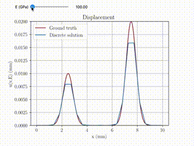

# NeuROM, a NN-PGD architecture based on the HiDeNN Framework

NeuROM provide a interpretable Deep Neural Network architecture that uses Tensor decomposition to provide a parametric reduced-order model. This interpretability of the network comes from the HiDeNN qrchitecture that provides an interpolation framework through a deep neural network which wight and biais are constrained so that the interpolation mnatches a finite element interpolation. 
The first hidden layers play the role of the shape functions while the last layer, called interpolation layer in the reminder of the document, utilises the output of the shape functions to interpolate the output. Training the weights of that last hidden layer is the same as solving a FEM problem on a fixed mesh. The weights of the interpolation layer directly correspond to the nodal values associated to each shape function. Therefore prescibing dirichlet boundary conditions is straight forward by freezing the weights associated to the prescribed values of fixed DoFs.


This code provides an implementation of a HiDeNN. The input of the layer is the coordinate $\underline{x}$ where the output is evaluated and the value of the parameters $\underline{\mu}$ for which the output is computed. In this case the output of the network is the displacement $\underline{u}\left(\underline{x},\underline{\mu}\right)$

## Folder's structure
``````
.
├── Bin
│   ├── PDE_Library.py
│   ├── Pre_processing.py
│   └── Training.py
│   
├── Geometries
│   ├── Beam.geo
│   └── Beam0.01.msh
│
├── HiDeNN_PDE.py
│
├── Illustrations
│   └── NeuROM_1D.gif
│
├── Post
│   └── Plots.py
│
├── README.md
│
├── TrainedModels
│   ├── ROM_1Para_np_10_nmodes_1_npara_1
│   └── ROM_1Para_np_50_nmodes_1_npara_1
│
└── main.py
``````


## Architecture of the NN

There are two level of modelling involved. The space interpolation in itself can be trained to get a solution for a given problem. Such interpolation is achieved using the model `MeshNN`. Building on that interpolation model and using a similar interpolation for the parametric space, a reduced-order model can e trained as well using the `NeuROM` class.


### Pre-processing
`Mesh` class that build the Geometry and mesh from the 
Inputs:
* Name of the geometry, 
* Max element size of the mesh

The method `.AddBCs` then allows to define Dirichlet boundary conditions and specify the volume element of the structure that should be considered.
Inputs:
* List of BCs (Physical surface, value, normal direction)
* volume index

Then the methods 
* `.MeshGeo()`                         
* `.ReadMesh()`                      
* `.AssemblyMatrix()` 
respectively mesh the geometry (if the mesh does not already exist), parse the mesh file, assemble the matrix later used for the assembly of each shape functions

### Space interpolation

Given a mesh object created using the `Mesh` class,  `MeshNN` gives a space interpolation of the quantity of interest using first or second order FE shape functions.

   * MeshNN class that, given a mesh, "assemble" the shape functions accordingly
        * `model = MeshNN(Beam_mesh,alpha)` Creates an interpolation model
        * Beam_mesh being a previously created mesh
   * The Dirichlet boudary conditions (BCs) are set by calling
        * `model.setBCs(u_0,u_L)` 
        * with $u_0$ and $u_L$ being the prescribed displacement at $x=0$ and $x=L$ respectivly

### Reduced-order modelling

Given a hypercube `ParameterHypercube` defining the parametric space, the Space dirichlet boundary conditions a mesh and the number of requested mode, a reduced-order model od the parametric field is built

`modelROM = NeuROM(Beam_mesh, BCs, n_modes, ParameterHypercube)`

#### Illustration of the ROM parametric solution



## Training the NN 


The Volumic forces are accounted for in the loss function through the right hand side (RHS) function and the loss function is the potential energy.

The trainable parameters can be changed on the fly. 

* `model.Freeze_Mesh()` Freezes the mesh so that only the nodale values are trained
* `model.UnFreeze_Mesh()` Unfreezes the mesh so that the coordinates values can be trained

* `model.Freeze_FEM()` Freezes the nodale values so that only the coordinates are trained
* `model.UnFreeze_FEM()` Unfreezes the nodale so that FEM problem can be solved

### Reduced-order modelling

The Volumic forces are accounted for in the loss function through the right hand side (RHS) function and the loss function is the potential energy.

The trainable parameters can be changed on the fly. 

* `modelROM.Freeze_Mesh()` Freezes the space mesh so that only the nodale values are trained
* `modelROM.UnFreeze_Mesh()` Unfreezes the space mesh so that the coordinates values can be trained

* `modelROM.Freeze_Space()` Freezes the space nodale values so that only the coordinates are trained
* `modelROM.UnFreeze_Space()` Unfreezes the space nodale so that FEM problem can be solved
* `modelROM.Freeze_MeshPara()` Freezes the parametric mesh so that only the nodale values are trained
* `modelROM.UnFreeze_MeshPara()` Unfreezes the parametric mesh so that the coordinates values can be trained

* `modelROM.Freeze_Para()` Freezes the parametric nodale values so that only the coordinates are trained
* `modelROM.UnFreeze_Para()` Unfreezes the parametric nodale so that FEM problem can be solved


## Licensing


 * Copyright (C) 2024, UMR 7649, École Polytechnique, IPP, CNRS, MΞDISIM Team, INRIA
 *
 * This program is free software: you can redistribute it and/or modify
 * it under the terms of the GNU General Public License as published by
 * the Free Software Foundation, either version 3 of the License, or
 * (at your option) any later version.
 *
 * This program is distributed in the hope that it will be useful,
 * but WITHOUT ANY WARRANTY; without even the implied warranty of
 * MERCHANTABILITY or FITNESS FOR A PARTICULAR PURPOSE.  See the
 * GNU General Public License for more details.
 *
 * You should have received a copy of the GNU General Public License
 * along with this program.  If not, see <https://www.gnu.org/licenses/>.
 */
