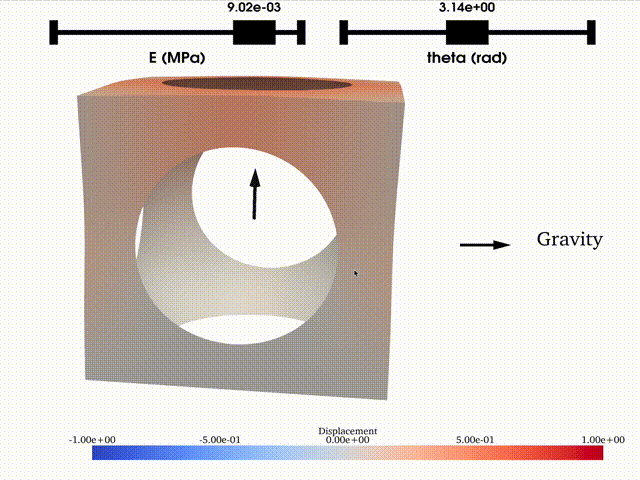

# NeuROM, a NN-PGD architecture based on the HiDeNN Framework

<h1 align="center">

</h1><br>

<!--   -->

[](https://github.com/alexandredabyseesaram/neurom)
[](
https://pypi.org/project/NeuROM-Py/)
[](https://doi.org/10.5281/zenodo.13772741)


NeuROM provides an interpretable deep neural network architecture that uses tensor decomposition to give a parametric reduced-order model. This network interpretability comes from the HiDeNN architecture that offers an interpolation framework through a deep neural network in which weights and biases are constrained so that the interpolation matches a finite element interpolation (P1 or P2). 
The first hidden layers play the role of the shape functions, while the last layer, called the interpolation layer in the remainder of the document, utilises the output of the shape functions to interpolate the output. Training the weights of that last hidden layer is the same as solving a FEM problem on a fixed mesh. The weights of the interpolation layer directly correspond to the nodal values associated with each shape function. Therefore, prescribing Dirichlet boundary conditions is straightforward by freezing the weights associated with the prescribed values of fixed DoFs. However, learning the parameters related to the first layers accounts for mesh adaptation.


This code implements a Finite Element Neural Network Interpolation (FENNI) based on the HiDeNN framework. The layer's input is the coordinate $\underline{x}$ where the output is evaluated and the value of the parameters $\underline{\mu}$ for which the output is computed. In this case, the output of the network is the displacement $\underline{u}\left(\underline{x},\underline{\mu}\right)$

## Installation

Start by creating a conda environment as follow:

```
conda create -n neurom-env python=3.12
```

### From PyPI
You can install the latest stable version of NeuROM directly from PyPI using pip:

```bash
pip install neurom-py
```


### From the sources (Github) in editable mode

The package can also be installed from the sources in editabl mode so that the user can modifiy the sources and run the modified version in a straightforward manner by

```bash
git clone https://github.com/AlexandreDabySeesaram/NeuROM.git
cd NeuROM
pip install -e .
```

### Recommendation 

To improve performances it is recommanded to further install the optimisation of einsum using conda as follows

````
conda install opt_einsum -c conda-forge
````

## Using the code

Executing the code is as easy as running

`neurom -cf Configurations/your_config.toml` where the option `-cf` stands for *configuration file* and allow the user to specify which configuration file should be used.

The code must be lauched from a folder containing two subfolders
* Configurations
  * where one or more configuration files are stored
* Geometries
  * where the gmsh .geo files are stored

The folder from which the code is launched should have the following architecture.  

``````
.
│
├── Geometries
│   └── Geometry.geo
└── Configurations
    └── your_config.toml
 ``````

## Repository's structure
``````
.
├── neurom
│       ├── HiDeNN_PDE.py
|       |
│       ├── src
│       |   ├── PDE_Library.py
│       |   ├── Pre_processing.py
│       |   └── Training.py
|       |
|       ├── Post
|       │   └── Plots.py
|       |
│       └── main.py
│   
├── Geometries
│   ├── Beam.geo
│   ├── Hole_3.geo
│   └── Hole.geo
│
│
├── Illustrations
│   └── NeuROM_1D.gif
|
│
├── README.md
│
└── TrainedModels
    | 
    └── 2D_Bi_Parameters_el_0.2
 

``````

## Architecture of the NN

There are two levels of modelling involved. The space interpolation in itself can be trained to get a solution for a given problem. Such interpolation is achieved using the model `MeshNN`. Building on that interpolation model and using a similar interpolation for the parametric space, a reduced-order model can also be trained using the `NeuROM` class.

### Data entry

A `config` file needs to be filled with the job parameters (name of the geometry, solvers' parameters, post-precessing required, etc.) A default file is specified at the top of the `main.py` script, but any other file can be passed as an argument when running the main script as `neurom -cf 'Configuration/config.toml'`.

### Pre-processing
`Mesh` class that builds the Geometry and the `Mesh_object` from the 
Inputs:
* `config["geometry"]["Name"]`:
* `config["interpolation"]["order"]`, 
* `config["interpolation"]["dimension"]`

The method `.AddBCs` then allows the definition of Dirichlet boundary conditions and specifies the volume element of the structure that should be considered.
Inputs:
* List of BCs (Physical surface, value, normal direction)
* volume index

Then the methods 
* `.MeshGeo()`                         
* `.ReadMesh()`                      
* `.AssemblyMatrix()` (if 1D)
respectively mesh the geometry (if the mesh does not already exist), parse the mesh file, assemble the matrix later used for the assembly of each shape functions

### Space interpolation

Given a mesh object created using the `Mesh` class,  `MeshNN` gives a space interpolation of the quantity of interest using first or second-order FE shape functions.

   * MeshNN class that, given a mesh, "assemble" the shape functions accordingly
        * `model = MeshNN_2D(Mesh_object)` (or `model = MeshNN_1D(Mesh_object)` in 1D) Creates an interpolation model
        * Mesh_object being the previously created mesh


### Reduced-order modelling

Given a hypercube `ParameterHypercube` defining the parametric space, the Space dirichlet boundary conditions a mesh and the maximum number of requested modes, a reduced-order model of the parametric field is built

`ROM_model = NeuROM(Mesh_object,ParameterHypercube,ConfigFile)`

#### Illustration of the ROM parametric solution





## Training the NN 


The Volumic forces are accounted for in the loss function through the right-hand side (RHS) function, and the loss function is the potential energy.

The trainable parameters can be changed on the fly. 

* `model.Freeze_Mesh()` Freezes the mesh so that only the nodal values are trained
* `model.UnFreeze_Mesh()` Unfreezes the mesh so that the coordinates values can be trained

* `model.Freeze_FEM()` Freezes the nodal values so that only the coordinates are trained
* `model.UnFreeze_FEM()` Unfreezes the nodal so that FEM problem can be solved

### Reduced-order modelling

The Volumic forces are accounted for in the loss function through the right-hand side (RHS) function, and the loss function is the potential energy.

The trainable parameters can be changed on the fly. 

* `ROM_model.Freeze_Mesh()` Freezes the space mesh so that only the nodal values are trained
* `ROM_model.UnFreeze_Mesh()` Unfreezes the space mesh so that the coordinates values can be trained

* `ROM_model.Freeze_Space()` Freezes the space nodal values so that only the coordinates are trained
* `ROM_model.UnFreeze_Space()` Unfreezes the space nodal so that FEM problem can be solved
* `ROM_model.Freeze_MeshPara()` Freezes the parametric mesh so that only the nodal values are trained
* `ROM_model.UnFreeze_MeshPara()` Unfreezes the parametric mesh so that the coordinates values can be trained

* `ROM_model.Freeze_Para()` Freezes the parametric nodal values so that only the coordinates are trained
* `ROM_model.UnFreeze_Para()` Unfreezes the parametric nodal so that FEM problem can be solved


## Licensing


  Copyright (C) 2024, UMR 7649, École Polytechnique, IPP, CNRS, MΞDISIM Team, INRIA
 
  This program is free software: you can redistribute it and/or modify it under the terms of the GNU General Public License as published by the Free Software Foundation, either version 3 of the License, or (at your option) any later version.
 
  This program is distributed in the hope that it will be useful, but WITHOUT ANY WARRANTY; without even the implied warranty of MERCHANTABILITY or FITNESS FOR A PARTICULAR PURPOSE.  See the GNU General Public License for more details.
 
  You should have received a copy of the GNU General Public License along with this program.  If not, see <https://www.gnu.org/licenses/>.
 
