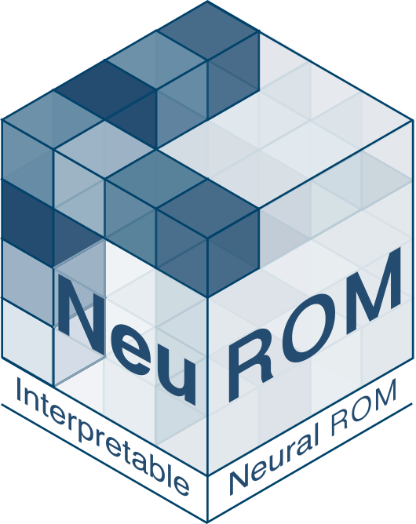

# NeuROM, a NN-PGD architecture based on the HiDeNN Framework

<h1 align="center">

</h1><br>

<!--   -->

[](https://github.com/alexandredabyseesaram/neurom)
[](
https://pypi.org/project/NeuROM-Py/)
[](https://doi.org/10.5281/zenodo.13772741)


 `NeuROM` provides an interpretable deep neural network architecture that uses tensor decomposition to give a parametric reduced-order model. This network interpretability comes from the HiDeNN architecture that offers an interpolation framework through a deep neural network in which weights and biases are constrained so that the interpolation matches a finite element interpolation (P1 or P2). 
The first hidden layers play the role of the shape functions, while the last layer, called the interpolation layer in the remainder of the document, utilises the output of the shape functions to interpolate the output. Training the weights of that last hidden layer is the same as solving a FEM problem on a fixed mesh. The weights of the interpolation layer directly correspond to the nodal values associated with each shape function. Therefore, prescribing Dirichlet boundary conditions is straightforward by freezing the weights associated with the prescribed values of fixed DoFs. However, learning the parameters related to the first layers accounts for mesh adaptation.


This code implements a Finite Element Neural Network Interpolation (FENNI) based on the HiDeNN framework. The layer's input is the coordinate $\underline{x}$ where the output is evaluated and the value of the parameters $\underline{\mu}$ for which the output is computed. In this case, the output of the network is the displacement $\underline{u}\left(\underline{x},\underline{\mu}\right)$

## Installation

Start by creating a `conda` environment as follow:

```
conda create -n neurom-env python=3.12
```

### From PyPI
You can install the latest stable version of NeuROM directly from PyPI using pip:

```bash
pip install neurom-py
```


### From the sources (`GitHub`) in editable mode

The package can also be installed from the sources in editable mode so that the user can modifiy the sources and run the modified version in a straightforward manner by

```bash
git clone https://github.com/AlexandreDabySeesaram/NeuROM.git neurom
cd neurom
pip install -e .
```

### Recommendation 

To improve performances it is recommanded to further install the optimisation of einsum using conda as follows

````
conda install opt_einsum -c conda-forge
````

## Using the code

**TODO**

## Repository's structure
``````
.
├── docs
│   ├── Makefile
│   └── src
│       ├── conf.py
│       └── index.md
├── pyproject.toml
├── README.md
├── scripts
│   ├── 1d_notebook
│   │   └── main.py
│   └── design_poc
│       └── main.py
├── src
│   ├── neurom
│   │   ├── constraints
│   │   │   ├── constraint.py
│   │   │   ├── dirichlet.py
│   │   │   ├── __init__.py
│   │   │   └── no_constraint.py
│   │   ├── fem_model.py
│   │   ├── field.py
│   │   ├── geometry
│   │   │   ├── barycentric_to_reference.py
│   │   │   ├── __init__.py
│   │   │   └── iso_parametric_mapping_1d.py
│   │   ├── __init__.py
│   │   ├── integrator.py
│   │   ├── interpolator.py
│   │   ├── meshes
│   │   │   ├── __init__.py
│   │   │   ├── mesh.py
│   │   │   └── topology.py
│   │   ├── quadratures
│   │   │   ├── __init__.py
│   │   │   ├── mid_point_1d.py
│   │   │   ├── quadrature_rule.py
│   │   │   └── two_points_1d.py
│   │   ├── reference_elements
│   │   │   ├── __init__.py
│   │   │   ├── reference_element.py
│   │   │   └── segment.py
│   │   └── shape_functions
│   │       ├── __init__.py
│   │       ├── linear_segment.py
│   │       ├── quadratic_segment.py
│   │       └── shape_function.py
│   └── neurom.egg-info
│       ├── dependency_links.txt
│       ├── PKG-INFO
│       ├── requires.txt
│       ├── SOURCES.txt
│       └── top_level.txt
├── tests
│   ├── integration
│   │   └── test_1d_beam_deflection.py
│   └── unit
│       └── test_iso_parametric_1d.py
└── uv.lock


## Architecture of the NN

**TODO**

### Data entry

**TODO**

### Space interpolation

**TODO**


### Reduced-order modelling

**TODO**


## Training the NN 

**TODO**

## Licensing

  Copyright (C) 2024, UMR 7649, École Polytechnique, IPP, CNRS, MΞDISIM Team, INRIA
 
  This program is free software: you can redistribute it and/or modify it under the terms of the GNU General Public License as published by the Free Software Foundation, either version 3 of the License, or (at your option) any later version.
 
  This program is distributed in the hope that it will be useful, but WITHOUT ANY WARRANTY; without even the implied warranty of MERCHANTABILITY or FITNESS FOR A PARTICULAR PURPOSE.  See the GNU General Public License for more details.
 
  You should have received a copy of the GNU General Public License along with this program.  If not, see <https://www.gnu.org/licenses/>.
 
