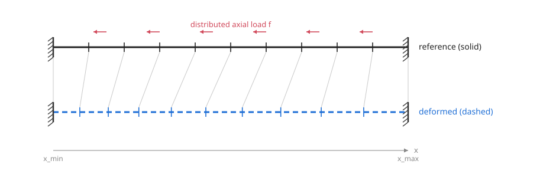

# 1D parametric bar deflection with CP-PGD

*Longitudinal deformation of the bar. The **solid** line is the reference
(undeformed) state, the **dashed** line the deformed one; the thin connectors
track how each material point moves axially. Both ends stay clamped
($u=0$), and the interior displaces under the distributed axial load.*

This example solves a parametric 1D bar problem with the Proper Generalized
Decomposition (PGD): the deflection $u$ is computed as a function of both the
position $x$ **and** the Young's modulus $E$, treated as an extra coordinate.
The companion script is [`1d_beam_deflection_PGD.py`](1d_beam_deflection_PGD.py).

## Problem setup

We minimise the potential energy of the bar. The bending energy is neglected in
front of the axial (compression) one, so with a single displacement field $u$:

$$\begin{aligned}
\mathcal{E} &= \frac{1}{2}\int_{\Omega}E\,\nabla u \cdot \nabla u \, - \int_{\Omega} fu \\
            &= \frac{1}{2}\int_{\Omega_{ref}}E\, \nabla u \cdot \nabla u \,J - \int_{\Omega_{ref}} fu\, J
\end{aligned}$$

The second line maps the integral onto the reference element, $J$ being the
Jacobian of the geometric map.

**Boundary conditions.** The bar is *clamped at both ends*:
$u(x_{\min}) = u(x_{\max}) = 0$. In the code this is a Dirichlet constraint on
the space axis, `Dirichlet(nodes=[0, N_space - 1], values_imposed=0)`. The two
ends are exact mesh nodes, so the constraint is imposed exactly.

## Finite-element discretisation and quadrature

During training we evaluate $u$ at the Gauss points so that the energy integral
is computed consistently with the polynomial discretisation of $u$. Here we use
a **single Gauss point per element** — the mid-point rule (`MidPoint1D`) — so on
each element the integral reduces to one evaluation:

$$\begin{gathered}
\mathcal{E}= \frac{1}{2}\sum_{e=1}^{N_e}\int_{e}E\,\nabla u \cdot \nabla u \,J - \sum_{e=1}^{N_e}\int_{e} fu\, J \\
= \frac{1}{2}\sum_{e=1}^{N_e} w_{g,e}\,E(x_{g,e})\,\nabla u(x_{g,e}) \cdot \nabla u(x_{g,e})\,J_e -\sum_{e=1}^{N_e}w_{g,e}\,f(x_{g,e})\,u(x_{g,e})\,J_e
\end{gathered}$$

With the finite-element discretisation $u$ reads

$$u(x) = \sum_{e=1}^{N_e} \sum_{i=1}^{2} u_{e,i}\, N_{e,i}\big(\phi^{-1}(x)\big).$$

Because we only ever evaluate it at the Gauss points, during training we compute

$$u(x_{g,e}) = u_{e,i}\, N_{e,i}\big(\phi^{-1}(x_{g,e})\big) = \tfrac{1}{2}u_{e,1} + \tfrac{1}{2}u_{e,2},$$

since on the reference element $[0,1]$ with linear shape functions
$N_1(\xi)= 1-\xi$ and $N_2(\xi)= \xi$, the single Gauss point is
$\xi_g = \tfrac{1}{2}$, hence

$$\begin{bmatrix} N_1(\xi_g) \\ N_2(\xi_g) \end{bmatrix} = \begin{bmatrix} \tfrac{1}{2} \\ \tfrac{1}{2} \end{bmatrix}.$$

Even though the shape-function values at the Gauss point are known in advance, we
do **not** simply take the half-sum of the nodal values: we evaluate through the
interpolator so that the autodiff graph is built — that graph is what lets us
differentiate the energy with respect to the nodal unknowns. Concretely,

$$\begin{bmatrix} \tfrac{1}{2} \\ \tfrac{1}{2} \end{bmatrix} = \phi^{-1}(x_g) = \phi^{-1}\big(\phi(\xi_g)\big),$$

where $\phi$ is the isoparametric geometric map
$x = \phi(\xi) = a_x N_1(\xi) + b_x N_2(\xi)$ (`IsoparametricMapping1D`).

## Young's modulus as a parameter — separated form

We now look for the solution in separated form, with the Young's modulus as a
parameter:

$$u(x, E) = \sum^m_{i=1}u_i(x)\,\lambda_i(E).$$

The energy becomes a double integral over $\Omega \times I_E$, which factorises
axis by axis:

$$\begin{aligned}
\mathcal{E} &= \int_{I_E}\int_{\Omega_{ref}}\Big[\tfrac{1}{2}E\, \nabla(u_i\lambda_i)\cdot \nabla(u_j \lambda_j) - fu_k\lambda_k\Big]\,J^u\,J^E \,dx \,dE \\
&= \Bigg(\int_{I_E}\tfrac{1}{2}E\,\lambda_i\lambda_j\,J^E \,dE \Bigg)\Bigg( \int_{\Omega}\nabla u_i\cdot\nabla u_j\,J^u \,dx\Bigg) \\
&\quad - \Bigg(\int_{I_E}\lambda_k\,J^E \,dE\Bigg)\Bigg(\int_{\Omega}f\,u_k\,J^u\,dx\Bigg) \\
&= \tfrac{1}{2}\,E_e\,\lambda_{ie}\lambda_{je}\,J^E_e \,\nabla u_{ix}\!\cdot\!\nabla u_{jx}\,J^u_x
- \lambda_{ke}\,J^E_e \,f_x\,u_{kx}\,J^u_x
\end{aligned}$$

The last line uses Einstein summation over the element index $e$ and the mode
indices $i,j,k$, with the discretised quantities

$$\lambda_{ke} = \lambda_k(E_{\text{gauss},\,e}) \quad\text{and}\quad u_{kx} = u_k(x_{\text{gauss},\,x}),$$

and likewise for the Jacobians $J^E, J^u$ and the load $f$.

## Constant load

In this example the load is **constant**, $f(x) = q = 1000$ (`load_value`). Being
constant in $E$, the source is itself rank-1 separable,

$$f(x, E) = f_0(x) \otimes 1(E),$$

so the parametric factor "$1$" is carried implicitly by the term
$G_m = \int_{I_E} \lambda_m \, J^E \, dE$. The load is built as a `Field` on the
space mesh and sampled at the **same** space quadrature points as $u$, so that
`inner(f, u)` aligns point-by-point.

## Discretisation used

Concretely the two axes fed to the decomposition are:

- **Space axis** — $x \in [0, 10]$ with $N_{\text{space}} = 30$ nodes, i.e. 29
  linear elements, clamped at both ends. This is a standard 1D FE mesh.
- **Parameter axis** — $E \in [10, 100]$ with $N_E = 20$ nodes, no constraint.
  This is a second, independent 1D FE mesh: the parametric coordinate is
  discretised exactly like a spatial one.

Each PGD monom lives on its own axis mesh: $w_m^x$ on the 30-node space mesh and
$w_m^E$ on the 20-node parameter mesh. A mode is their product
$u_m(x, E) = w_m^x(x)\,w_m^E(E)$.

## Greedy PGD enrichment

The modes are built **one at a time** (greedy enrichment):

1. start with a single mode and minimise the energy over its two factors;
2. *freeze* that converged mode, *add* a fresh one, and train only the new
   factors — which therefore fit the residual left by the previous modes;
3. repeat up to `n_modes_max` (here 3).

In the code this is `pgd_approx.freeze_mode(...)`, `pgd_approx.add_mode()` and
`pgd_approx.add_mode_to_optimizer(...)`. Even though the exact solution here is
rank-1 (a single mode is enough), we deliberately add several modes to exercise
the enrichment machinery; the extra modes come out small.

## Analytical reference and results

The exact deflection is

$$u(x, E) = \tfrac{1}{2}\, q\, (x - x_{\min})(x - x_{\max}) / E,$$

which is itself rank-1 separable: a spatial parabola times $1/E$. The script
compares the trained PGD to this reference through four panels:

1. the full solution $u(x, E)$ at a fixed $E$, swept over $x$ (space parabola);
2. the full solution at a fixed $x$, swept over $E$ (the $1/E$ parametric curve);
3. the space factor $w_m^x(x)$ of every mode against the analytical space shape
   (normalised — only the shapes are comparable, since each factor carries an
   arbitrary scale);
4. the same for the parametric factor $w_m^E(E)$ against the analytical $1/E$
   shape.

Mode 0 already matches the analytical shape; the higher modes are small
corrections. Panels 3–4 show the factors mode by mode; the full "sum of modes"
reconstruction is what panels 1–2 compare against the analytical solution.

## Implementation note

The separated energy is assembled with the library helpers rather than a hand-
written `einsum`: `neurom.inner.inner` contracts the field and physical
directions (e.g. $\nabla u_m \cdot \nabla u_n$) and `neurom.integrate.integrate`
performs the quadrature sum, inside a loop over the mode pairs $(m, n)$. Under
the hood, the tensor assembly of the decomposition
(`CPPGD.assemble` / `CPPGD.evaluate`) *does* use `torch.einsum` to contract the
separated factors across axes — so the einsum is there, simply wrapped by the
`inner` / `integrate` API used in the `energy()` function.
